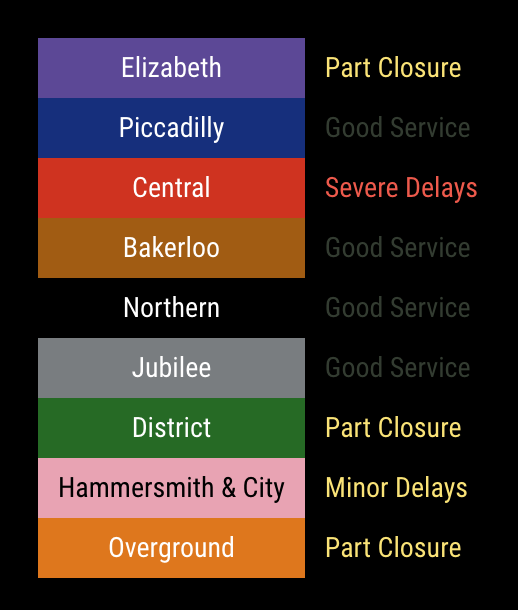

# MMM-TLF-Status 
## Magic Mirror Module for Trasport For London Status



This a module for the [MagicMirror](https://github.com/MichMich/MagicMirror).  

This module shows the status of the Transport for London (TLF) lines including:
- Tube
- Elizabeth Line
- DLR
- Overground
- Tram
- Bus


## Installation
Navigate into your MagicMirror's `modules` folder and execute `git clone https://github.com/emanuele-albini/MMM-TLF-Status`. 
A new folder `MMM-TLF-Status` will appear, navigate into it.

The package does not require any additional dependency.

## Configuration
The entry in `config.js` can include the following options:

|Option|Description|
|---|---|
<!-- |`app_id`|**Required (SEE NOTES)** This is the App ID assigned to you on the TfL Open Data Portal.  Details on how to request an App ID can be found [here](https://api-portal.tfl.gov.uk/docs)<br><br>**Type:** `string`<br>|
|`api_key`|**Required (SEE NOTES)** This is the API key assigned to you on the TfL Open Data Portal.  Details on how to request an API key can be found [here](https://api-portal.tfl.gov.uk/docs)<br><br>**Type:** `string`<br>| -->
|`modes`| Modes for which to gather the status from TFL API.<br><br>**Type:** `array` of `string` <br>**Default value:** `['tube', 'elizabeth_line', 'dlr', 'overground']`|
|`lines`| Array of lines to visualise.<br><br>**Type:** `array` of `string` (lines id, or name, in lower-case) <br>**Default value:** `null // all`|
|`lines_order`| Order in which to visualise the lines. The lines listed here will be visualised first (in the order specified). <br><br>**Type:** `array` of `string`  <br>**Default value:** `['elizabeth', 'jubilee', 'piccadilly', 'bakerloo', 'northern', 'dlr', 'victoria', 'district', 'circle', 'london-overground']`|
|`blacklistLines`| If `true`, `lines` will act as a balcklist (all the lines but those specified will be visualised). <br><br>**Type:** `boolean` <br>**Default value:** `false`|
|`hide_good`| This determines if the module displays hides lines that have good service (`true`) or shows all of the lines (`true`). If this is used and all lines have good service then only a single line indicates this. <br><br>**Type:** `boolean`<br>**Default value:** `false`|
|`interval`| How often the TFL status is updated.<br><br>**Type:** `integer`<br>**Default value:** `600000 // 10 minutes`|

Here is an example of an entry in `config.js`
```
{
    module:		'MMM-TLF-Status',
    position:	'top_left',
    header:		'TFL Status',
    config:		{
        hide_good: false,
        interval: 15 * 60 * 1000, // 15 minutes
    }
},
```

## Credits
This module is based and considerably extends [Nigel Daniels](https://github.com/nigel-daniels/)'s module [MMM-Tube-Status](https://github.com/nigel-daniels/MMM-Tube-Status).

This module extends it by:
- Allow to show also additional TFL lines (and not only Tube lines);
- Allow to sort the lines in a custom order;
- Removing the dependency from `request` package.
